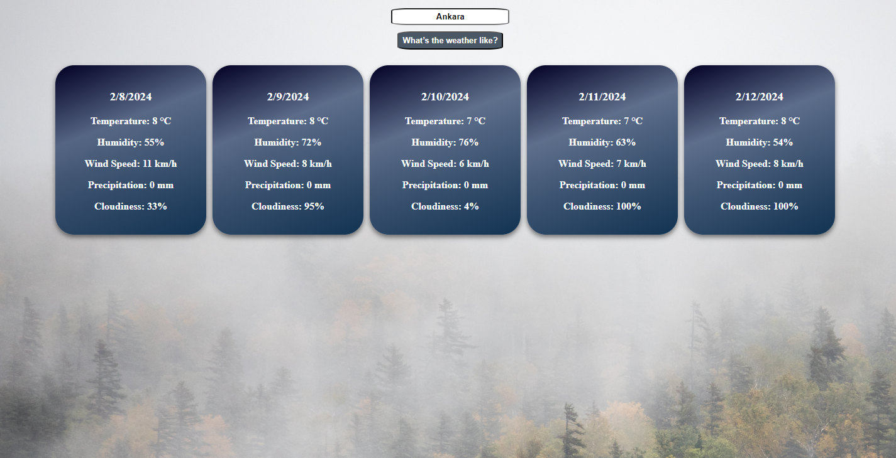

# Weather Forecast React Application

A simple React application for checking the weather forecast using the OpenWeatherMap API. Users can input a city name and get detailed information, including temperature, humidity, wind speed, precipitation, and cloudiness.

## Features

- Weather data from OpenWeatherMap API.
- 5-day weather forecast for the specified city.
- User-friendly interface with easy city search functionality.

## API Key Setup

To use this application, you need to obtain an API key from OpenWeatherMap. Follow these steps:

- Visit [OpenWeatherMap](https://openweathermap.org/) and sign up for a free account.
- Generate a new API key.
- Copy the generated API key.

## Configuration

- Create a new file named .env in the root of your project.
- Add the following lines.

```
REACT_APP_API_URL = 'https://api.openweathermap.org/data/2.5/forecast'
REACT_APP_API_KEY = 'paste_your_api_key_here'
```

## How to Run

1. Clone the project.

```
```
2. Navigate to the project folder.

```
cd .\weather-app\
```
3. Install the required packages.

```
npm install
```
4. Start the application.

```
npm start
```
5. Open `http://localhost:3000` in your browser.

## Usage
- Enter the city name on the home page.
- Click the "What’s the weather like?" button.
- Weather information will be displayed on the screen.

## Screenshot



## Technologies Used
- React
- OpenWeatherMap API
- HTML
- CSS

